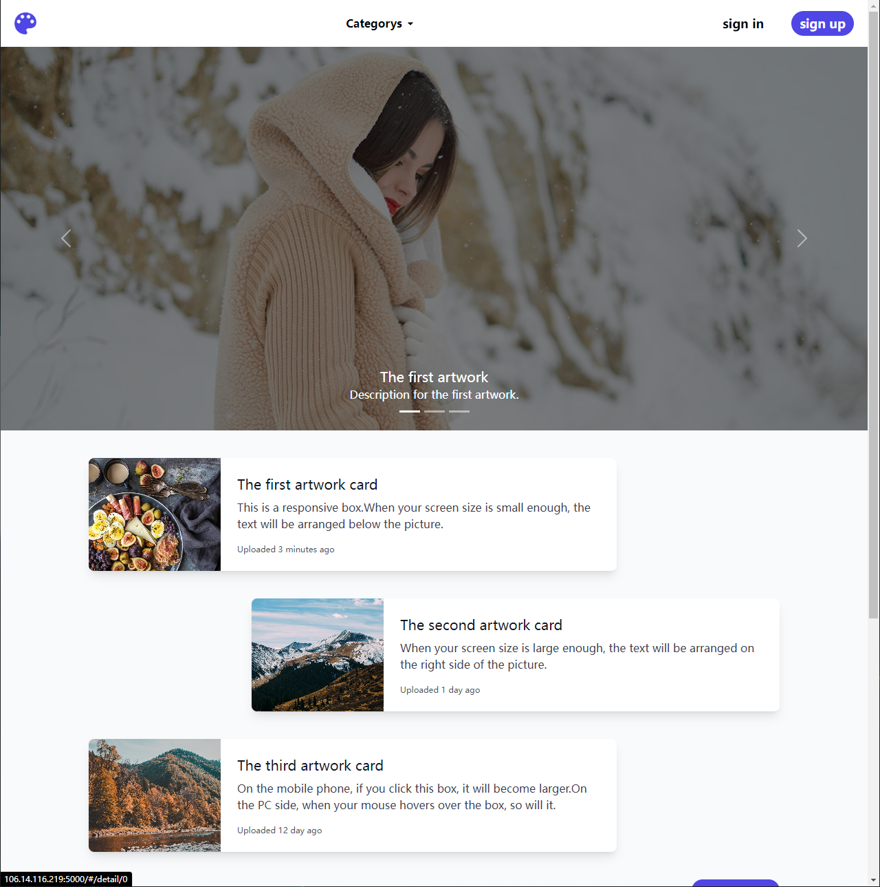
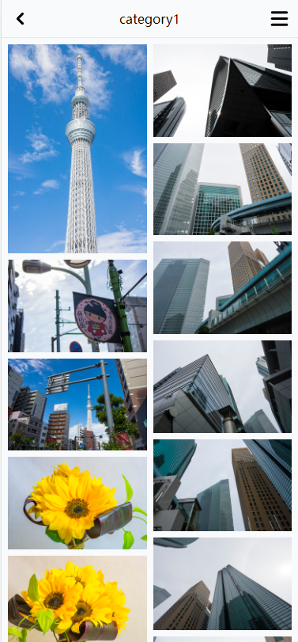
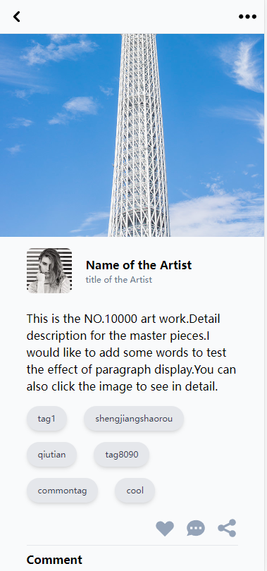

<div align="center"> <a href="https://github.com/1421582341/Art-Exhibition">  </a> <br> <br>

[](LICENSE)

<h1>Vue art exhibition</h1>
</div>

## 简介

Vue art exhibition是一个用于展示个人艺术作品的开源网站。使用了`vue3`,`vite2`,`TypeScript`等主流技术开发。本项目主要针对前端开发，为了训练应用axios的能力，配套了基于`express`的后端。本项目仅供学习参考。

## 特性

&#x1F680; Vue3,Vite2 - 快速启动

&#129470; TypeScript

&#127853; tailwindCSS - 更易于迁移

&#128515; HeroIcons - tailwind生态下的svg图标

&#127919; animate.css - 丝滑动画效果

&#128161; \<script setup\> - setup语法糖更简洁的代码，更高效的性能

&#11088; Responsive - 支持pc&#128421;移动	
&#128241;双端浏览

&#127839; cors - 跨域支持

## 预览

- [vue-art-exhibition](http://106.14.116.219:5000/) - 个人站点
<p align="center">
  
  
  
</p>

## 快速开始

- 获取项目代码
```bash
git clone https://github.com/1421582341/Art-Exhibition.git
```

- 安装依赖
```bash
cd backend
yarn
cd ..
cd frontend
yarn
```

- 运行
```bash
cd backend
node app.js
cd..
cd frontend
yarn run dev
```

## 开发日志

[vue-art-exhibition开发笔记](https://1421582341.github.io/learn-note/)

## 浏览器支持

本地开发推荐使用`Chrome 80+` 浏览器

支持现代浏览器, 不支持 IE

| [](http://godban.github.io/browsers-support-badges/)</br>IE | [](http://godban.github.io/browsers-support-badges/)</br>Edge | [](http://godban.github.io/browsers-support-badges/)</br>Firefox | [](http://godban.github.io/browsers-support-badges/)</br>Chrome | [](http://godban.github.io/browsers-support-badges/)</br>Safari |
| :-: | :-: | :-: | :-: | :-: |
| not support | last 2 versions | last 2 versions | last 2 versions | last 2 versions |